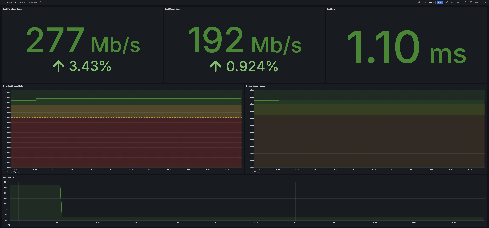

# Speedtest Tracker Prometheus Exporter

## Overview

This exporter is designed to export latest speedtest metrics from Speedtest Tracker (https://github.com/alexjustesen/speedtest-tracker) in Prometheus format

While the default dashboard from this software is very useful, this exporter is useful to scrape the latest speedtest information into Prometheus (https://prometheus.io/) for dashboarding in Grafana (https://grafana.com/)

## Running

The image for this is published to DockerHub - https://hub.docker.com/repository/docker/devinsmith/speedtest-prometheus-exporter

You can run the exporter with default configuration as follows:

```bash
docker run -it -p 8080:8080 -e SPEEDTEST_API_URL=http://myapiurl.com devinsmith/speedtest-prometheus-exporter:latest
```

## Configuration

By default, the exporter exposes the metric path on port 8080

The exporter expects the following environment variables:

| Variable Name              | Required (Y/N) | Default Value| Description
| :---------------- | :------: | ----: | ----: | 
| SPEEDTEST_API_URL        |   Yes   | None | URL of the Speedtest tracker server
| URL_SUBPATH          |   No   | /api/speedtest/latest | Subpath of the API endpoint on the Speedtest server to read from
| METRICS_ENDPOINT    |  No   | /metrics | Endpoint on which this exporter exposes Prometheus metrics
| PORT    |  No   | 8080 | Port for this exporter to expose metrics
| LOG_LEVEL    |  No   | INFO | Logging level for the exporter (DEBUG, INFO, WARNING, ERROR, CRITICAL)

## Scraping the exporter from Prometheus
Adding the following configuration to your prometheus.yaml config file, should result in the exporter being scraped and metrics existing Prometheus

```bash
  - job_name: speedtest
    static_configs:
      - targets:
          - speedtest_exporter:8080
```

These should result in the following metrics existing in prometheus


## Grafana dashboard Example

### Dashboard JSON

[Json](./grafana-dashboard.json)


### Dashboard Screenshot
